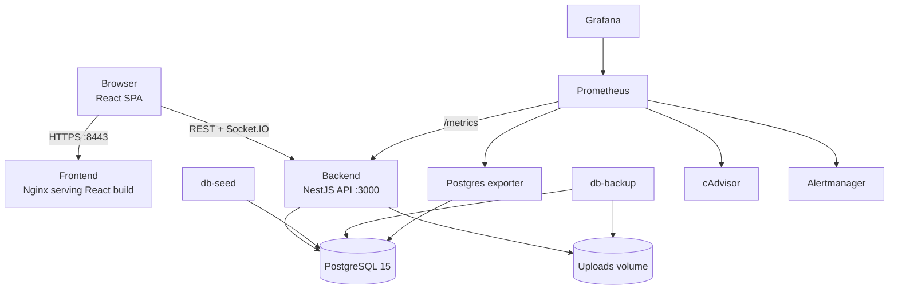
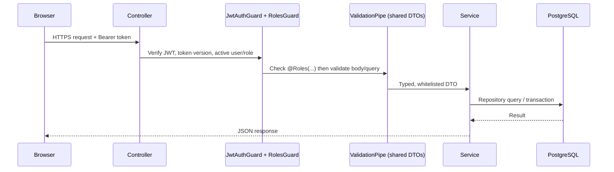
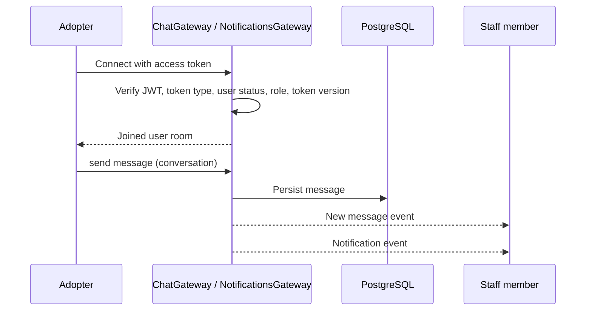
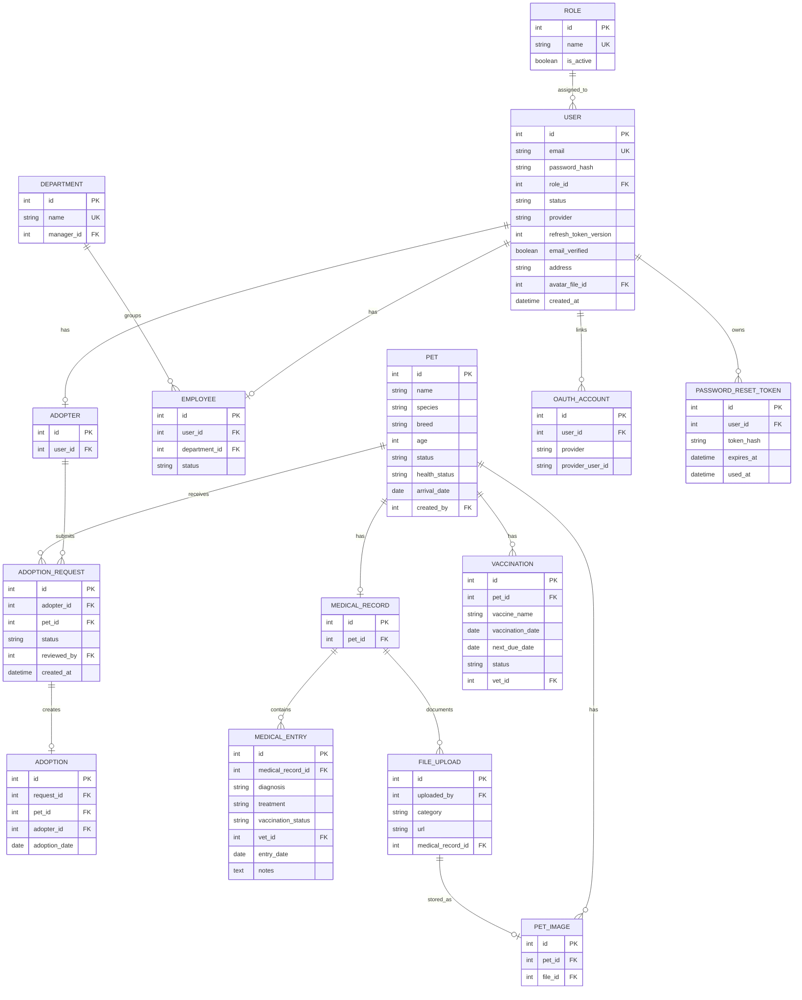
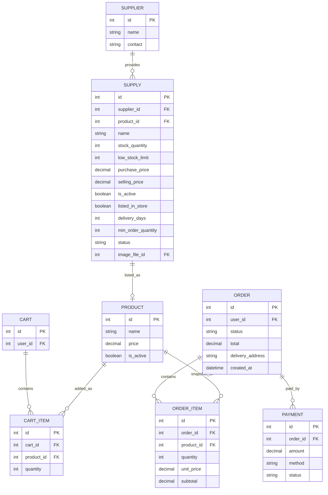
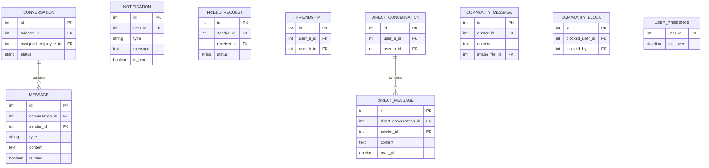
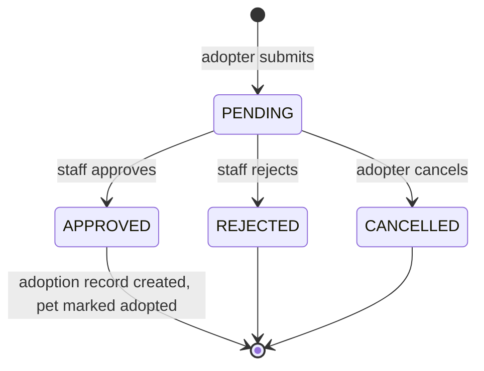
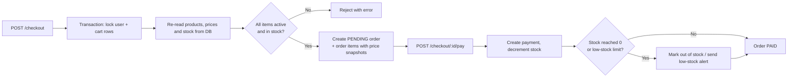

*This project has been created as part of the 42 curriculum by lkhazaal, falhaimo, sshawish, rabu-shr, malsharq.*

# Petopia — Pet Adoption Management System

## Table of Contents

- [Description](#description)
- [Team Information](#team-information)
- [Project Management](#project-management)
- [Technical Stack](#technical-stack)
- [System Architecture](#system-architecture)
- [Database Schema](#database-schema)
- [Core Workflows](#core-workflows)
- [Features List](#features-list)
- [Modules and Points](#modules-and-points)
- [Individual Contributions](#individual-contributions)
- [Instructions](#instructions)
- [Security](#security)
- [Testing](#testing)
- [Challenges and Solutions](#challenges-and-solutions)
- [Known Limitations](#known-limitations)
- [Resources and AI Usage](#resources-and-ai-usage)

---

## Description

**Petopia** (Pet Adoption Management System) is a full-stack, role-based shelter management platform developed as part of the `ft_transcendence` project of the 42 Common Core.

Animal shelters usually juggle separate tools for publishing pets, handling adoption requests, tracking veterinary care, managing supplies, talking to adopters and producing reports. Petopia centralizes all of these workflows in a single web application where each user role — visitor, adopter, employee, veterinarian, manager and administrator — gets a focused dashboard containing only the tools it is allowed to use.

Adopters register, verify their email, submit adoption requests, shop for pet supplies and chat with shelter staff. Staff review requests and manage pets, vets maintain medical and vaccination records, and managers and admins oversee inventory, users, departments, reports and analytics. Access control is enforced on the backend, and realtime features keep chats, notifications and presence up to date without page refreshes.

### Key Features

- Adopter signup with email verification, login, logout, token refresh and password reset.
- Google OAuth 2.0 login.
- JWT access tokens and revocable refresh tokens (refresh-token versioning).
- Five roles (`ADMIN`, `MANAGER`, `VET`, `EMPLOYEE`, `ADOPTER`) with role-specific dashboards and backend guards.
- Public pet catalog with filtering and pagination, and detailed pet profiles with images.
- Adoption request workflow: submit, cancel, approve, reject, and automatic adoption record creation.
- Veterinary medical records, medical entries, protected medical documents and bulk medical data import.
- Vaccination tracking with next-due dates and status.
- Inventory and supplier management with low-stock detection and alerts.
- Online store, persistent cart, transactional checkout, payment and orders.
- Realtime support chat between adopters and a shared staff inbox (Socket.IO).
- Community feed, friends, friend requests, direct messages, blocking and online presence.
- Persistent and realtime notifications.
- Protected file uploads (avatars, pet images, supply images, medical documents, community images).
- Reports with CSV, PDF and XML export; dashboards with charts and analytics.
- Activity logs for auditing important actions.
- Public API secured with API keys, rate limiting and documentation.
- Custom design system with a shared color palette, typography, icons and reusable components.
- Internationalization in English, Arabic and French, with full RTL layout for Arabic.
- Light/dark theme support.
- Monitoring with Prometheus, Grafana, Alertmanager, Postgres exporter and cAdvisor.
- Health and readiness endpoints, plus scheduled database and upload backups.
- Fully containerized with Docker Compose over HTTPS.

### Project Goal

The goal of the project is to demonstrate a complete, production-minded web application combining:

1. Secure authentication and role-based authorization.
2. Relational database design with versioned migrations.
3. A modular REST API with strict input validation.
4. Realtime communication over authenticated WebSockets.
5. Transaction-safe commerce and inventory operations.
6. Protected file management.
7. Internationalization and RTL accessibility.
8. Observability, backups and containerized deployment.

---

## Team Information


### `lkhazaal`

**Role:** Product Owner (PO), Backend Developer

**Responsibilities:**

- Defining the product vision and the needs of adopters, staff, vets, managers and admins.
- Prioritizing features and validating that delivered work matches user needs.
- Real-time features and user-to-user interaction.
- Support chat, community feed, online status, friends and direct messages.
- Inventory, suppliers, supplies, store and cart.
- Advanced search and filtering, and the public API.

### `falhaimo`

**Role:** Project Manager (PM), Full-Stack Developer

**Responsibilities:**

- Task distribution, progress tracking and delivery priorities.
- Coordinating integration between frontend and backend work.
- Pet catalog, adoption workflow, medical records and vaccinations.
- Notifications, reports and internationalization.
- Design system and public API.

### `sshawish`

**Role:** Technical Lead / Architect, Backend Developer

**Responsibilities:**

- Overall architecture and technical decisions.
- NestJS module structure, shared package design and code consistency.
- Authentication, OAuth, email sending, roles and permissions.
- Orders, checkout and payment.
- Users and departments, file management, Import medical documents, dashboards and analytics.
- Backend reviews.

### `rabu-shr`

**Role:** Frontend Developer

**Responsibilities:**

- UI/UX, responsive layouts and theme support.
- Reusable UI components and the design system.
- Public pages and internationalization, including Arabic RTL.

### `malsharq`

**Role:** DevOps Engineer, Developer

**Responsibilities:**

- Docker and Docker Compose setup.
- Environment configuration and deployment readiness.
- HTTPS serving, monitoring stack, health checks and backups.
- Operational support for running and evaluating the project.

---

## Project Management

### Work Organization

The team followed a role-based Agile workflow with feature-based development:

1. The Product Owner defined the main business needs for each user role.
2. The Technical Lead defined the architecture: monorepo layout, NestJS modules, shared contracts and database design.
3. The Project Manager split the work into feature areas and assigned them by domain (frontend, backend, DevOps).
4. Each major module was planned, implemented, tested locally and integrated into the full system.
5. Core adoption workflows were delivered first, followed by operational dashboards, inventory/store, reports, notifications, realtime/community features, monitoring and deployment.

Work was divided into three streams:

- **Frontend:** pages, role-based UI flows, responsive layouts, reusable components, i18n and UX.
- **Backend:** API modules, entities, authentication, validation, business logic, migrations and seeding.
- **DevOps:** Docker, environment configuration, HTTPS, monitoring, health checks and backups.


The team held regular sync meetings to review progress, unblock integration issues and re-prioritize remaining work.

### Tools

- **Git / GitHub:** source control, feature branches (e.g. `feature/adoption-request-flow`, `fix/login-validation`), pull requests and code review by the Technical Lead or the owner of the touched area.


### Communication Channels

- **_[Slack]_:** technical discussions, architecture alignment and code review.
- **_[WhatsApp]_:** urgent blockers and quick scheduling updates.

---

## Technical Stack

The project is a **TypeScript monorepo** with three npm workspaces:

| Workspace | Purpose |
|---|---|
| `Backend/` | NestJS API, TypeORM entities, migrations, seeders, auth, sockets, reports, uploads, monitoring |
| `Frontend/` | React/Vite single-page app, role-based pages, components, contexts, API client, i18n |
| `shared/` | DTOs, enums, constants, validators, socket event names and types used by both sides |

### Frontend

| Technology | Purpose |
|---|---|
| React 18 | Component-based user interface |
| Vite | Fast development server and production build |
| TypeScript | Type safety across the UI and API client |
| Tailwind CSS | Utility-first styling and consistent design |
| Radix UI | Accessible UI primitives (dialogs, menus, etc.) |
| MUI icons, lucide-react | Icon sets |
| Recharts | Dashboard and analytics charts |
| Sonner | Toast notifications |
| Socket.IO client | Realtime chat, notifications and presence |

### Backend

| Technology | Purpose |
|---|---|
| Node.js 20+ | Runtime |
| NestJS 11 | Modular backend: controllers, services, DI, guards, pipes, WebSocket gateways |
| TypeORM | Entities, repositories, relations, migrations, transactions and row locks |
| Passport, JWT | Access/refresh token authentication |
| Passport Google OAuth 2.0 | Social login |
| bcrypt | Password hashing |
| class-validator, class-transformer | DTO validation and transformation |
| Socket.IO (NestJS WebSockets) | Realtime gateways |
| Helmet | Security HTTP headers |
| NestJS Throttler | Rate limiting on authentication routes |
| Multer | File uploads |
| PDFKit | PDF report generation |
| Nodemailer / NestJS Mailer | Verification and password-reset emails |
| prom-client (via Metrics module) | Prometheus metrics endpoint |

### Database and Infrastructure

| Technology | Purpose |
|---|---|
| PostgreSQL 15 | Main relational database |
| Docker, Docker Compose | Multi-container orchestration |
| Nginx | Serves the built frontend over HTTPS |
| Prometheus | Metrics collection |
| Grafana | Monitoring dashboards |
| Alertmanager | Alert routing and email notifications |
| Postgres exporter | Database metrics |
| cAdvisor | Container metrics |
| Backup container | Scheduled PostgreSQL and uploads backups |

### Why These Technologies?

**TypeScript everywhere** gives strong typing across backend, frontend and the `shared/` package, which catches integration mistakes at compile time instead of at runtime.

**NestJS** provides an enterprise-style structure — modules, controllers, services, dependency injection, guards, pipes and WebSocket gateways — which suits a project with around twenty business domains and five roles.

**React + Vite** give a fast development loop, component reuse across five role dashboards and a single-page experience.

**PostgreSQL** was chosen because the domain is highly relational (users → roles, adopters → requests → pets → adoptions, carts → orders → payments, supplies → suppliers → products). It provides foreign keys, unique constraints, transactions and row-level locking, which checkout relies on to protect stock.

**TypeORM** integrates natively with NestJS, maps tables to TypeScript classes and supports versioned migrations, transactions and pessimistic locks.

**The shared package** keeps DTOs, enums, constants and socket event names identical on both sides, so the frontend can never send a status value the backend doesn't accept.

**JWT + refresh-token versioning** keeps access tokens stateless while still allowing logout and password change to revoke all old sessions.

**Socket.IO** provides rooms, reconnection and a simple event model for chat, notifications and presence.

**Docker Compose** makes the full stack — database, API, frontend, seeding, backups and monitoring — reproducible with a single command for evaluation.

**Prometheus + Grafana** add real operational visibility (request rates, errors, database and container health) instead of only local development tooling.

---

## System Architecture



### Request Flow



### Realtime Flow



---

## Database Schema

PostgreSQL is accessed through TypeORM. Entities live in `Backend/src/database/entities/`, and every schema change is a versioned migration in `Backend/src/database/migrations/` (`synchronize` is disabled).


### Tables by Domain

| Domain | Tables |
|---|---|
| Accounts & access | `users`, `roles`, `oauth_accounts`, `password_reset_tokens`, `activity_logs` |
| People & organization | `adopters`, `employees`, `departments` |
| Pets & adoption | `pets`, `pet_images`, `adoption_requests`, `adoptions` |
| Medical | `medical_records`, `medical_entries`, `vaccinations` |
| Inventory & commerce | `suppliers`, `supplies`, `products`, `carts`, `cart_items`, `orders`, `order_items`, `payments` |
| Communication | `conversations`, `messages`, `notifications` |
| Community | `community_messages`, `community_blocks`, `friendships`, `friend_requests`, `direct_conversations`, `direct_messages`, `user_presence` |
| Files | `file_uploads` |

### Core: Accounts, Pets, Adoption and Medical



### Inventory, Store and Orders



### Communication and Community



All tables above also reference `users` (sender, author, owner, recipient, etc.).

### Key Constraints and Rules

- Unique email per user; emails are trimmed and lowercased.
- Unique role names and unique department names.
- One adopter or employee profile per user; one cart per user; one medical record per pet.
- Unique line items per cart/order (no duplicate product rows).
- Soft deletion for medical entries and vaccinations.
- Concurrency columns on critical tables to protect against conflicting updates.
- Analytics indexes to keep dashboard queries fast.
- Order items store price snapshots so historical orders never change when prices do.

---

## Core Workflows

### Adoption Request Lifecycle



Each status change triggers a notification to the relevant user.

### Checkout and Payment



The browser never decides prices or totals — everything is recalculated on the server.

---

## Features List


| Feature | Description | Contributor(s) |
|---|---|---|
| Authentication | Signup, email verification, login, refresh, logout, change/forgot/reset password | `sshawish`, `falhaimo` |
| Google OAuth | Login with Google | `sshawish` |
| Roles & permissions | Five roles, `JwtAuthGuard`, `RolesGuard`, `@Roles()` decorator, role-guarded frontend routing | `sshawish` |
| Public pages | Home, about, terms, privacy, public pet browsing | `falhaimo`, `rabu-shr` |
| Pet catalog | Filtering, pagination, pet details, image uploads, create/update/delete | `falhaimo`, `sshawish` |
| Adoption workflow | Submit, cancel, approve, reject requests; adoption records | `falhaimo` |
| Medical records | Entries, protected documents, PDF/row import, bulk document delete | `falhaimo`, `sshawish` |
| Vaccinations | Vaccine records, next-due dates, status | `falhaimo` |
| Inventory & suppliers | Supplies, suppliers, stock, low-stock detection, supply images | `falhaimo`, `lkhazaal` |
| Store, cart & checkout | Store catalog, persistent cart, transactional checkout, payment | `sshawish`, `lkhazaal` |
| Orders | Adopter order history and operational order views | `sshawish` |
| Users & departments | Employee creation, user management, departments, department managers | `sshawish` |
| Support chat | Adopter conversations and shared staff inbox with assign/release | `lkhazaal` |
| Community & social | Community feed, friends, friend requests, direct messages, blocking, presence, public profiles | `lkhazaal` |
| Notifications | Stored and realtime notifications, unread count, mark as read | `falhaimo` |
| File management | Protected file serving, admin file listing, deletion, upload progress | `sshawish` |
| Reports | Adoption, inventory and pet reports with CSV/PDF/XML export | `falhaimo` |
| Dashboards & analytics | Admin, manager, staff, vet and adopter dashboards with charts; activity logs | `sshawish` |
| Internationalization | English, Arabic and French with RTL layout | `falhaimo`, `rabu-shr` |
| UI / UX | Responsive layouts, reusable components, theming | `rabu-shr` |
| Public API | API-key–secured endpoints with rate limiting and documentation | `rabu-shr`, `falhaimo`, `sshawish`, `lkhazaal`, `malsharq` |
| Design system | Shared color palette, typography, icons and reusable UI components | `rabu-shr`, `falhaimo` |
| Docker & deployment | Compose stack, HTTPS frontend, environment configuration, seeding | `malsharq` |
| Monitoring | Prometheus, Grafana, Alertmanager, exporters, `/metrics` | `malsharq` |
| Health & backups | Health/readiness endpoints, scheduled DB and upload backups, restore script | `malsharq` |

---

## Modules and Points

Major modules are worth **2 points**, Minor modules **1 point**.


| # | Category | Module | Type | Points | Contributor(s) |
|---:|---|---|---|---:|---|
| 1 | Web | Use a framework for both frontend and backend | Major | 2 | `sshawish`, `falhaimo`, `rabu-shr`, `lkhazaal` |
| 2 | Web | Real-time features using WebSockets | Major | 2 | `falhaimo`, `lkhazaal` |
| 3 | Web | Allow users to interact with other users (chat, profiles, friends) | Major | 2 | `lkhazaal` |
| 4 | Web | Use an ORM for the database | Minor | 1 | `sshawish` |
| 5 | Web | Complete notification system | Minor | 1 | `falhaimo` |
| 6 | Web | Advanced search with filters, sorting and pagination | Minor | 1 | `falhaimo`, `sshawish`, `lkhazaal` |
| 7 | Web | File upload and management system | Minor | 1 | `sshawish` |
| 8 | Web | Custom-made design system with reusable components | Minor | 1 | `rabu-shr`, `falhaimo` |
| 9 | Accessibility | Support for multiple languages (at least 3) | Minor | 1 | `falhaimo`, `rabu-shr` |
| 10 | Accessibility | Right-to-left (RTL) language support | Minor | 1 | `rabu-shr`, `falhaimo` |
| 11 | User Management | Standard user management and authentication | Major | 2 | `sshawish`, `lkhazaal` |
| 12 | User Management | Remote authentication with OAuth 2.0 | Minor | 1 | `sshawish` |
| 13 | User Management | Advanced permissions system | Major | 2 | `sshawish` |
| 14 | User Management |  User activity analytics and insights dashboard | Minor | 1 | `sshawish` |
| 15 | DevOps | Monitoring system with Prometheus and Grafana | Major | 2 | `malsharq` |
| 16 | DevOps | Health check, status endpoints and automated backups | Minor | 1 | `malsharq` |
| 17 | Data & Analytics | Data export and import functionality | Minor | 1 | `sshawish`, `falhaimo` |

**Total: 6 Major × 2 + 11 Minor × 1 = 23 points**

### Module Justification and Implementation

#### 1. Frameworks for Frontend and Backend — Major, 2 points

**Why:** A platform with five role dashboards and around twenty business domains needs structure on both sides.
**How:** The frontend is a React 18 + Vite SPA in TypeScript. The backend is a NestJS 11 application split into feature modules (`AuthModule`, `PetsModule`, `AdoptionsModule`, `CheckoutModule`, `ChatModule`, …), each with controllers, services, DTO validation and guards.
**Who:** `sshawish`, `falhaimo`, `rabu-shr`, `lkhazaal`.

#### 2. Real-Time Features — Major, 2 points

**Why:** Support chat, notifications and presence are useless if users have to refresh the page.
**How:** NestJS Socket.IO gateways (`ChatGateway`, `NotificationsGateway`). Each socket is authenticated by JWT (signature, token type, active user and role, refresh-token version) and joined to a user-specific room. Frontend hooks `useConversationSocket` and `useNotificationSocket` subscribe to shared event names defined in `shared/events/socket.events.ts`. Reconnection is handled by Socket.IO, and logging out invalidates old sockets through token versioning.
**Who:** `falhaimo`, `lkhazaal`.

#### 3. User Interaction — Major, 2 points

**Why:** Adopters benefit from talking to staff and to each other about pets and adoption.
**How:** Support chat between adopters and a shared staff inbox (assign/release conversations, read state), plus a community layer: public profiles, adopter search, friend requests, friends list, direct conversations, community feed with images, and blocking.
**Who:** `lkhazaal`.

#### 4. ORM — Minor, 1 point

**Why:** The schema has more than thirty related tables; type-safe mapping and versioned migrations are essential.
**How:** TypeORM entities, repositories, relations, transactions and pessimistic row locks. `synchronize` is disabled and all schema changes go through migrations; development and production seeders populate data.
**Who:** `sshawish`.

#### 5. Notification System — Minor, 1 point

**Why:** Users must know when their request is approved, a message arrives or stock runs low.
**How:** Notifications are persisted in the `notifications` table and pushed live through `NotificationsGateway`. Endpoints expose listing, unread count, mark-one and mark-all as read. Inventory alerts are only visible to operational roles.
**Who:** `falhaimo`.

#### 6. Advanced Search and Filtering — Minor, 1 point

**Why:** Adopters need to narrow a pet catalog quickly; staff need to find users and records.
**How:** `GET /pets` accepts filters (species, breed, status, age range…) validated by `shared/dto/find-pets-query.dto.ts`, with server-side pagination rendered by the reusable `Pagination` component. Adopter search supports the friends system.
**Who:** `falhaimo`, `sshawish`, `lkhazaal`.

#### 7. File Upload and Management — Minor, 1 point

**Why:** Pets need photos, vets need medical PDFs, users need avatars — and medical documents must not be public.
**How:** Multer uploads with category-specific validation rules from `shared/constants/uploads.constants.ts`. Metadata is stored in `file_uploads`; files are served only through `GET /files/:fileId` after an authorization check, with `realpath`-based path containment. Admins can list and delete files, vets can bulk-delete documents, and the frontend shows upload progress and authenticated previews.
**Who:** `sshawish`.

#### 8. Custom-Made Design System — Minor, 1 point

**Why:** Five role dashboards must look and behave consistently without rebuilding the same controls on every page.
**How:** A shared color palette and typography defined in the Tailwind theme and applied through `ThemeProvider` (light/dark), a consistent icon set, and more than 10 reusable components used across many pages: `Navbar`, `DashboardLayout`, `PetCard`, `ProductCard`, `InputField`, `Badge`, `KpiCard`, `Pagination`, `Modal`, `EmptyState`, `AuthenticatedImage`, `FilePreview`, `UploadProgress` and `LanguageSwitcher`.
**Who:** `rabu-shr`, `falhaimo`.

#### 9. Multiple Languages — Minor, 1 point

**Why:** The shelter serves a multilingual audience.
**How:** `LanguageProvider` with translation files in `Frontend/src/i18n/` covering interface text, activity logs, notifications and localized API error messages, in English, Arabic and French. A `LanguageSwitcher` is available on every page.
**Who:** `falhaimo`, `rabu-shr`.

#### 10. RTL Support — Minor, 1 point

**Why:** Arabic users need a layout that reads naturally right-to-left.
**How:** The language context switches document direction to `rtl` for Arabic, and components use direction-aware styling. Browser tests (`i18n.browser.mjs`, `i18n-interactions.browser.mjs`) check the RTL behavior.
**Who:** `rabu-shr`, `falhaimo`.

#### 11. Standard User Management — Major, 2 points

**Why:** Every workflow depends on reliable accounts and profiles.
**How:** Signup with email verification, secure login, profile editing, avatar upload, change/forgot/reset password, friends and online presence (heartbeat + `user_presence`). Email changes through profile updates are blocked by `PreventEmailChangeMiddleware`.
**Who:** `sshawish`, `lkhazaal`.

#### 12. Remote Authentication (OAuth 2.0) — Minor, 1 point

**Why:** Users can log in without creating yet another password.
**How:** `OAuthModule` with a Passport Google strategy. The callback exchanges the code for a local session and links the Google identity in `oauth_accounts`. Google-created accounts cannot log in with a local password.
**Who:** `sshawish`.

#### 13. Advanced Permissions — Major, 2 points

**Why:** Five roles with very different capabilities must never see each other's tools or data.
**How:** `JwtAuthGuard`, `RolesGuard` and `@Roles(...)` on every protected endpoint; ownership checks (adopters only see their own requests, carts and orders); inactive users or roles cannot authenticate; admins manage users, employees, departments and roles. The frontend mirrors these rules for UX, but enforcement is always server-side.
**Who:** `sshawish`.

#### 14. Analytics and dashboard — Minor, 1 point

**Why:** Administrators and managers need activity insights to understand system usage, monitor user engagement, and identify the most active users and common actions.
**How:** The backend stores user activity in the `activity_logs` table and exposes the protected GET /`dashboard/user-activity` endpoint. It provides total activities, unique active users, average activity per user, activity trends, action and entity breakdowns, top users, date-range filtering, and result limits. The admin and manager dashboards display these insights using charts, KPIs, activity summaries, and recent activity logs.
**Who:** `sshawish`.

#### 15. Monitoring with Prometheus and Grafana — Major, 2 points

**Why:** A production-style system needs visibility into performance and failures.
**How:** The backend exposes `/metrics` with HTTP metrics collected by an interceptor. Prometheus scrapes the backend, Postgres exporter and cAdvisor; alert rules live in `monitoring/prometheus/rules/pet-adoption-alerts.yml`; Alertmanager routes alerts by email; Grafana is provisioned with a datasource and a `pet-adoption-monitoring` dashboard, protected by admin credentials from the environment.
**Who:** `malsharq`.

#### 16. Health Checks and Backups — Minor, 1 point

**Why:** The system must report its own status and survive data loss.
**How:** `/health`, `/ready` (checks the database) and `/version` endpoints; Docker health checks on every service; a `db-backup` container running `backup-db.sh` and `backup-uploads.sh` on a schedule, with `restore-db.sh` for recovery.
**Who:** `malsharq`.

#### 17. Data Export and Import — Minor, 1 point

**Why:** Reports must leave the system (spreadsheets, printing, data exchange), and vets need to bring in existing records.
**How:** Adoption, inventory and pet reports export to CSV, PDF (PDFKit) and XML. Vets can import medical data from rows or PDFs, individually or in bulk, through the `MedicalDataImport` component.
**Who:** `sshawish`, `falhaimo`.

---

## Individual Contributions

### `lkhazaal` — Product Owner, Backend Developer

**Features:** Inventory & suppliers, store/cart/, support chat, community & social.
**Modules:** Frameworks (1), Real-time features (2), User interaction (3), Advanced search (7).

**Main components:**

- Product requirements and user stories for each role, and acceptance of delivered features.
- Real-time communication over authenticated Socket.IO gateways.
- Support chat between adopters and the shared staff inbox (assign/release, read state).
- Community feed, public profiles, adopter search, friend requests, friends, direct messages and blocking.
- Inventory, suppliers, supplies, store and cart workflows.
- Search and filtering behavior.

**Challenge:** WebSocket connections bypass the normal HTTP guards, so logged-out or deactivated users could keep receiving events.
**Solution:** Sockets are verified on connection (JWT signature, token type, active user and role, refresh-token version) before joining any room.

### `falhaimo` — Project Manager, Full-Stack Developer

**Features:** Pet catalog, adoption workflow, medical records, vaccinations, notifications, reports, public pages, internationalization.
**Modules:** Frameworks (1), Real-time features (2), Notification system (6), Advanced search (7), Design system (9), Multiple languages (10), RTL (11), Data export/import (17).

**Main components:**

- Task planning, prioritization and integration coordination.
- Pet catalog and pet detail workflows.
- Adoption request lifecycle (submit, cancel, approve, reject, adoption record creation).
- Medical records, medical entries, document uploads and vaccination records.
- Low-stock alerts.
- Stored and realtime notifications.
- Adoption, pet reports with CSV/PDF/XML export.

**Challenge:** Keeping adoption rules consistent — a pet must not be adopted twice, and cancelled or rejected requests must never create an adoption.
**Solution:** Status transitions are validated in the service layer, and approval creates the adoption and updates the pet and request status together.

### `sshawish` — Technical Lead, Backend Developer

**Features:** Authentication, Google OAuth, roles & permissions, order/payment/checkout, users & departments, file management, dashboards & analytics, data import.
**Modules:** Frameworks (1), ORM (5), Advanced search (7), File upload (8), Standard user management (12), OAuth (13), Advanced permissions (14), Data export/import (17).

**Main components:**

- Monorepo and `shared/` package design (DTOs, enums, constants, socket events).
- NestJS module structure, global `ValidationPipe`, Helmet and CORS setup.
- TypeORM entities, migrations and seeders.
- Signup, email verification, login, logout, refresh, change/forgot/reset password with hashed tokens.
- Google OAuth strategy and account linking; `JwtAuthGuard`, `RolesGuard`, `@Roles()` and ownership rules.
- Transactional checkout and order views for adopters and operational roles.
- User, employee and department management.
- Protected file upload, serving and deletion with path-safety checks.
- Dashboard metrics and analytics endpoints.

**Challenges:**

- *Session revocation:* JWTs stay valid until they expire, so logout and password change could not really end a session. A per-user `refreshTokenVersion` embedded in tokens now invalidates old refresh tokens and sockets when incremented.
- *Concurrent checkout:* two adopters could buy the last item at the same time, or tamper with prices in the browser. Checkout runs in a TypeORM transaction that locks the relevant rows, re-reads stock and prices from the database, stores price snapshots and decrements stock only at payment.

### `rabu-shr` — Frontend Developer

**Features:** UI/UX, public pages, internationalization.
**Modules:** Frameworks (1), Public API (4), Design system (9), Multiple languages (10), RTL (11).

**Main components:**

- Design system: palette, typography, icons and reusable components (`Navbar`, `DashboardLayout`, `PetCard`, `ProductCard`, `InputField`, `Badge`, `KpiCard`, `Pagination`, `Modal`, `EmptyState`, `LanguageSwitcher`…).
- Responsive layouts and theme support.
- Public pages.
- Arabic RTL layout.

**Challenge:** Making every page work correctly in Arabic RTL without duplicating layouts.
**Solution:** Direction-aware styling driven by the language context, verified by browser i18n tests.

### `malsharq` — DevOps Engineer, Developer

**Features:** Docker & deployment, monitoring, health & backups.
**Modules:** Public API (4), Monitoring (15), Health checks and backups (16).

**Main components:**

- `docker-compose.yml` with PostgreSQL, backend, HTTPS frontend, seed job, backups and monitoring services.
- Environment configuration for development and production.
- Prometheus configuration and alert rules, Grafana provisioning, Alertmanager email routing.
- Backup and restore scripts.
- Service health checks and startup ordering.

**Challenge:** Services starting before the database was ready, causing failed migrations and seeding.
**Solution:** Health checks (`pg_isready`, backend `/ready`) with dependency conditions so each service waits for the one it needs.

---

## Instructions

### Prerequisites

- **Docker** and **Docker Compose v2** (Docker Desktop must be running).
- **Git**.
- **Node.js 20+** and **npm** — only needed to run the project outside Docker.
- **PostgreSQL 15** — only needed when running the database outside Docker.
- A modern browser (Google Chrome recommended).
- Optional: a Gmail/SMTP app password for email verification and password reset, and Google Cloud OAuth credentials for Google login.

### 1. Clone the Repository

```bash
git clone <repository-url>
cd pet_adoption
```

### 2. Configure the Environment

The backend reads `.env.development` or `.env.production` depending on `NODE_ENV`.

```bash
cp .env.example .env.development
cp .env.example .env.production   # used by the Docker stack
cp Frontend/.env.example Frontend/.env.local   # optional, frontend-only values
```

Fill in at least the following variables:

| Variable | Purpose | Example |
|---|---|---|
| `PORT` | Backend API port | `3000` |
| `FRONTEND_URL` / `FRONTEND_URLS` | Allowed CORS origin(s) | `https://localhost:8443` |
| `POSTGRES_HOST` | Database host | `postgres` (Docker) |
| `POSTGRES_PORT` | Database port | `5432` |
| `POSTGRES_DB` | Database name | `pet_adoption` |
| `POSTGRES_USER` | Database user | `pet_adoption_user` |
| `POSTGRES_PASSWORD` | Database password | a strong password |
| `JWT_SECRET` | Access-token secret | long random string |
| `JWT_REFRESH_SECRET` | Refresh-token secret | different long random string |
| `JWT_EXPIRES_IN` | Access-token lifetime | `15m` |
| `JWT_REFRESH_EXPIRES_IN` | Refresh-token lifetime | `7d` |
| `VITE_API_BASE_URL` | API URL used by the frontend | `http://localhost:3000` |
| `MAIL_USER`, `MAIL_PASSWORD` | Email sender credentials | app password |
| `GOOGLE_CLIENT_ID`, `GOOGLE_CLIENT_SECRET` | Google OAuth credentials | from Google Cloud |
| `GOOGLE_CALLBACK_URL` | OAuth callback | `http://localhost:3000/auth/google/callback` |
| `GRAFANA_ADMIN_USER`, `GRAFANA_ADMIN_PASSWORD` | Grafana login | your choice |
| `ALERT_EMAIL_*` | Alertmanager email settings | SMTP values |

Generate strong secrets, for example:

```bash
openssl rand -hex 64
```

> Never commit real `.env` files, passwords or OAuth credentials.

### 3. Build and Start with Docker (recommended)

```bash
docker compose up --build
```

| Service | Purpose |
|---|---|
| `postgres` | PostgreSQL database |
| `backend` | NestJS API (runs pending migrations in production mode) |
| `frontend` | React build served over HTTPS |
| `db-seed` | Seeds the database if it is empty |
| `db-backup` | Scheduled database and upload backups |
| `prometheus` | Metrics collection |
| `grafana` | Monitoring dashboards |
| `postgres-exporter` | Database metrics |
| `cadvisor` | Container metrics |
| `alertmanager` | Alert routing |

Check that everything is healthy:

```bash
docker compose ps
docker compose logs -f backend
```

### 4. Open the Application

| URL | What |
|---|---|
| `https://localhost:8443` | Petopia frontend |
| `http://localhost:3000/health` | Backend health |
| `http://localhost:3000/ready` | Backend readiness (includes DB check) |
| `http://localhost:3000/metrics` | Prometheus metrics |
| `[API docs URL — to confirm]` | Public API documentation |


The frontend uses a self-signed development certificate — accept the browser warning to continue.

### 5. Try the Main Flows

1. Browse pets on the home page without logging in.
2. Sign up as an adopter and verify your email.
3. Submit an adoption request for a pet.
4. Log in as an employee/admin and approve or reject it — the adopter receives a live notification.
5. As an adopter, add store items to the cart, check out and pay; watch stock decrease on the inventory page.
6. Open a support chat as an adopter and answer it from the staff inbox in a second browser.
7. As a vet, add a medical entry, upload a document and record a vaccination.
8. As a manager/admin, open analytics and export a report as CSV, PDF or XML.
9. Switch the language to Arabic to see the RTL layout.

### 6. Local Development (without Docker)

```bash
npm install                 # installs all workspaces
npm run migration:run       # apply migrations
npm run seed -w pet-adoption-backend   # optional development data
npm run backend:dev         # http://localhost:3000
npm run frontend:dev        # http://localhost:5173 (second terminal)
```

### 7. Useful Scripts

| Command | Description |
|---|---|
| `npm run backend:build` | Build the backend |
| `npm run frontend:build` | Build the frontend |
| `npm run migration:generate` | Generate a new migration |
| `npm run migration:run` | Run migrations |
| `npm run migration:revert` | Revert the latest migration |
| `npm run seed -w pet-adoption-backend` | Development seed data |
| `npm run seed:production -w pet-adoption-backend` | Production seed data |
| `docker compose config` | Validate the Compose file |

### 8. Stop the Project

```bash
docker compose down        # stop, keep data
docker compose down -v     # stop and delete volumes (database and uploads)
```

---

## Security

- Passwords hashed with **bcrypt**.
- **JWT** access tokens and separately signed refresh tokens; `refreshTokenVersion` revokes all sessions on logout or password change.
- Email-verification and password-reset tokens are stored **hashed**, never in plain text.
- Local login blocked until the email is verified; inactive users or roles cannot authenticate.
- **Helmet** security headers and **CORS** restricted to configured origins.
- Global `ValidationPipe` with `whitelist`, `transform` and `forbidNonWhitelisted` — unexpected fields are rejected.
- **Rate limiting** on authentication routes.
- Role guards on every protected endpoint and authenticated WebSockets.
- Files served only through authorized endpoints with safe path resolution.
- Middleware prevents email changes via profile updates.
- Activity logs for important actions.
- HTTPS for the frontend.

---

## Testing

| Area | Tests |
|---|---|
| Auth | `Backend/test/auth/email-normalization.test.ts`, `email-verification.test.ts` |
| Chat | `Backend/test/chat/shared-inbox.test.cjs` |
| Community | `Backend/test/community/avatar.test.cjs`, `community.test.cjs` |
| Medical | `Backend/test/medical/bulk-documents.test.ts`, `medical-import.test.ts` |
| Reports | `Backend/test/reports/xml-export.test.ts` |
| Uploads | `Backend/test/uploads/file-management.test.ts` |
| i18n / RTL | `Frontend/tests/i18n.test.mjs`, `i18n.browser.mjs`, `i18n-interactions.browser.mjs` |
| Frontend flows | `Frontend/tests/community.browser.mjs`, `orders.browser.mjs`, `validation.test.mjs` |
| Files | `Frontend/test/data-transfer.test.cjs`, `file-management.test.cjs`, `upload-progress.test.cjs` |

```bash
npm test -w pet-adoption-backend
npm run test:chat -w pet-adoption-backend
npm run test:i18n -w pet-adoption-frontend
npm run test:i18n:browser -w pet-adoption-frontend
```

---

## Challenges and Solutions

### Concurrent Checkout and Stock

**Challenge:** Two users buying the last unit at the same moment, or a user tampering with prices in the browser.
**Solution:** Checkout runs in a database transaction with row locks, recalculates prices and stock from the database, stores price snapshots in order items and decrements stock only on payment.

### Revoking Stateless Tokens

**Challenge:** JWTs stay valid until they expire, even after logout.
**Solution:** A `refreshTokenVersion` stored per user and embedded in tokens; incrementing it on logout or password change invalidates old refresh tokens and sockets.

### Protecting Medical Documents

**Challenge:** Medical PDFs must not be reachable through public static URLs.
**Solution:** Files are tracked in `file_uploads` and served through `/files/:fileId` after an authorization check, with path-containment checks against directory traversal.

### Keeping Frontend and Backend in Sync

**Challenge:** Five developers touching the same statuses, DTOs and socket events.
**Solution:** A `shared/` workspace imported by both sides, so contracts are defined once.

### Realtime Authentication

**Challenge:** WebSockets bypass normal HTTP guards.
**Solution:** A dedicated WebSocket JWT guard verifying signature, token type, active user/role and token version before joining rooms.

### Three Languages and RTL

**Challenge:** Translating not only labels but also notifications, activity logs and backend error messages, and flipping layouts for Arabic.
**Solution:** Centralized translation modules, localized API errors in the client, and direction-aware styling tested in the browser.

### Reliable Startup

**Challenge:** A ten-service stack where services depend on each other.
**Solution:** Docker health checks and dependency conditions, automatic migrations in production and an idempotent seed job.

---

## Known Limitations

- Payments are simulated inside the application; no real payment provider is integrated.
- The HTTPS certificate is self-signed for local evaluation.
- Email verification and password reset require valid SMTP credentials in the environment.
- Google OAuth requires your own Google Cloud credentials and callback URL.
- Automated test coverage focuses on critical areas and is not exhaustive.

---

## Resources and AI Usage

### Documentation and References

- [NestJS Documentation](https://docs.nestjs.com/)
- [TypeORM Documentation](https://typeorm.io/)
- [PostgreSQL Documentation](https://www.postgresql.org/docs/)
- [React Documentation](https://react.dev/)
- [Vite Documentation](https://vite.dev/guide/)
- [TypeScript Handbook](https://www.typescriptlang.org/docs/)
- [Tailwind CSS Documentation](https://tailwindcss.com/docs)
- [Radix UI Documentation](https://www.radix-ui.com/)
- [Socket.IO Documentation](https://socket.io/docs/v4/)
- [Passport.js Documentation](https://www.passportjs.org/)
- [Google Identity — OAuth 2.0](https://developers.google.com/identity/protocols/oauth2)
- [JWT Introduction](https://jwt.io/introduction)
- [class-validator](https://github.com/typestack/class-validator)
- [Prometheus Documentation](https://prometheus.io/docs/)
- [Grafana Documentation](https://grafana.com/docs/)
- [Docker Documentation](https://docs.docker.com/) and [Docker Compose](https://docs.docker.com/compose/)
- [OWASP Authentication Cheat Sheet](https://cheatsheetseries.owasp.org/cheatsheets/Authentication_Cheat_Sheet.html)
- [MDN — Right-to-left and `dir` attribute](https://developer.mozilla.org/en-US/docs/Web/HTML/Global_attributes/dir)

### AI Usage

AI tools were used as development assistance, and all generated suggestions were reviewed, tested and adapted by the team. They were used for:

- **Understanding requirements:** clarifying the ft_transcendence subject and module rules.
- **Learning:** explaining NestJS guards/pipes, TypeORM transactions and locks, Socket.IO authentication and Prometheus/Grafana configuration.
- **Backend:** reviewing the checkout transaction logic, token-versioning approach and file path-safety checks.
- **Frontend:** help with translation strings for Arabic and French and with RTL styling issues.
- **DevOps:** diagnosing Docker, health-check and networking errors.
- **Testing:** suggesting test cases for authentication, uploads and i18n.
- **Documentation:** drafting and structuring this README and the project study guide.
